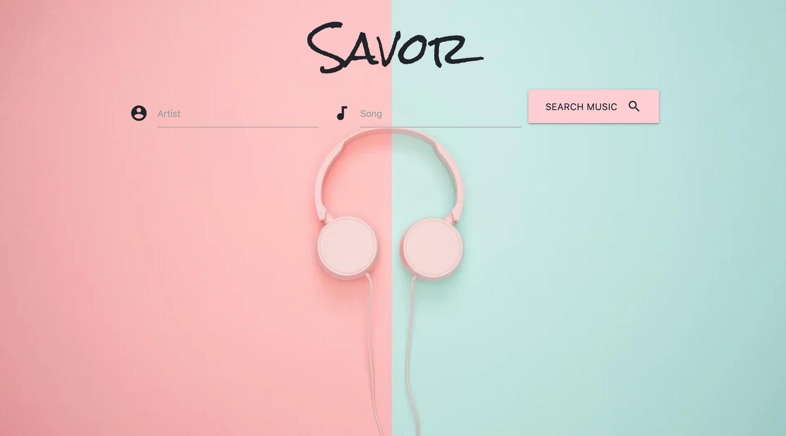

# Savor

## Description

Have you ever heard a song and thought, "What did that person just say?"? Well, you're not alone! Whether you want to stop mumbling the lyrics to the song you love, or learn all the lyrics before a concert Savor is the best app to get your favorite artist's lyrics. The user can easily search the artist and song and the song lyrics will show on the screen.

## Table of Contents

* [Usage](#usage)

* [Technology](#Technology)

* [Questions](#questions)

## Usage
<!-- 
 -->

https://caseyvanalstyne.github.io/Savor/

Enter the artist and song and the lyrics and artist information will appear.

## Technology
In this app we are using Materialize, HTML, JavaScript, JQuery, CSS, Itunes API, and lyrics.ovh API.

## Questions

Casey VanAlstyne | 

Laura Hernandez | 

Matt Henry | 

Mónica Polanco Fabián | MonicaPolancoFabian15@gmail.com
